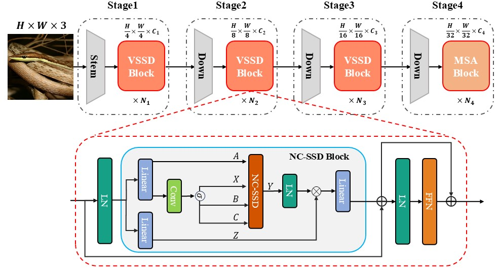

<div align="center">
<h1>VSSD </h1>
<h3>VSSD:  Vision Mamba with Non-Causal State Space Duality</h3>

Paper: ([arXiv:2407.18559](https://arxiv.org/abs/2407.18559))
</div>

## Updates
* **` August. 05th, 2024`**: We release log and ckpt for VSSD with MESA.
* **` July. 29th, 2024`**: When introduce [MESA](https://arxiv.org/abs/2205.14083) in training as [MLLA](https://github.com/LeapLabTHU/MLLA), VSSD-B achieve 85.4% top-1 acc on ImageNet-1K !
* **` July. 25th, 2024`**: We release the code, log and ckpt for VSSD.


## Introduction
Recently, State Space Duality (SSD), an improved variant of SSMs, was introduced in Mamba2 to enhance model performance and efficiency. 
However, the inherent causal nature of SSD/SSMs restricts their applications in non-causal vision tasks. 
To address this limitation, we introduce Visual State Space Duality (VSSD) model, which has a non-causal format of SSD.
This repository contains the code for training and evaluating VSSD varints on the ImageNet-1K dataset for image classification, COCO dataset for object detection, and ADE20K dataset for semantic segmentation.
For more information, please refer to our [paper](https://arxiv.org/abs/2407.18559).

<p align="center">
  
</p>

## Main Results

### **Classification on ImageNet-1K**

|    name    | pretrain | resolution |  acc@1   | #params | FLOPs |                                               logs                                                | ckpts |
|:----------:| :---: | :---: |:--------:|:-------:|:-----:|:-------------------------------------------------------------------------------------------------------:| :-------------------------------------------------------------------------------------------------------:|
| VSSD-Micro | ImageNet-1K | 224x224 |   82.5   |   14M   | 2.3G  |   [log](https://drive.google.com/drive/folders/1XWqLj4neH-MGktIe35l1orVUrKr6ry5V?usp=drive_link)   |[ckpt](https://huggingface.co/YuhengSSS/VSSD/blob/main/vssd_micro_best.pth)|
| VSSD-Tiny  | ImageNet-1K | 224x224 |   83.6   |   24M   | 4.5G  |                                              [log](https://drive.google.com/drive/folders/1fguht9zoIBmS1WD9prqzYHD0APPG16Ub?usp=drive_link)                                              | [ckpt](https://huggingface.co/YuhengSSS/VSSD/blob/main/vssd_tiny_best_ema.pth)|
| VSSD-Small | ImageNet-1K | 224x224 |   84.1   |   40M   | 7.4G  |                                              [log](https://drive.google.com/drive/folders/1uXSfgD7A4ZVHRqcFFS7OQhbXIzVkoxB9?usp=drive_link)                                              | [ckpt](https://huggingface.co/YuhengSSS/VSSD/blob/main/vssd_small_best_ema.pth)|
| VSSD-Base  | ImageNet-1K | 224x224 | **84.7** |   89M   | 16.1G |                                              [log](https://drive.google.com/drive/folders/18KDn-jIi3NKnZ6e7Gd0-luEbbqQ1Q_6G?usp=drive_link)                                              | [ckpt](https://huggingface.co/YuhengSSS/VSSD/blob/main/vssd_base_best_ema.pth)|

**Enhanced model with [MESA](https://github.com/YuHengsss/VSSD/blob/1a430bda2910affef8fc42ab9d581b742a0810ce/classification/main.py#L314):**

|    name    | pretrain | resolution |  acc@1   | #params | FLOPs |                                             logs                                              | ckpts |
|:----------:| :---: | :---: |:--------:|:-------:|:-----:|:-------------------------------------------------------------------------------------------------------:|:-------------------------------------------------------------------------------------------------------:|
| VSSD-Tiny | ImageNet-1K | 224x224 |   84.1   |   24M   | 4.5G  | [log](https://huggingface.co/YuhengSSS/VSSD/blob/main/vssd_tiny_e300_with_mesa.txt)                                                | [ckpt](https://huggingface.co/YuhengSSS/VSSD/blob/main/vssd_tiny_e300_with_mesa.pth)|
| VSSD-Small | ImageNet-1K | 224x224 |   84.5   |   40M   | 7.4G  |[log](https://huggingface.co/YuhengSSS/VSSD/blob/main/vssd_small_e300_with_mesa.txt)                                                | [ckpt](https://huggingface.co/YuhengSSS/VSSD/blob/main/vssd_small_e300_with_mesa.pth)|
| VSSD-Base  | ImageNet-1K | 224x224 | **85.4** |   89M   | 16.1G |[log](https://huggingface.co/YuhengSSS/VSSD/blob/main/vssd_base_e300_with_mesa.txt) | [ckpt](https://huggingface.co/YuhengSSS/VSSD/blob/main/vssd_base_e300_with_mesa.pth)|

### **Object Detection on COCO**
  
|  Backbone  | #params | FLOPs |  Detector   | box mAP | mask mAP |                                              logs                                              | ckpts |
|:----------:|:-------:|:-----:|:-----------:|:-------:|:--------:|:----------------------------------------------------------------------------------------------:|:-------------------------------------------------------------------------------------------------------:|
| VSSD-Micro |   33M   | 220G  | MaskRCNN@1x |  45.4   |   41.3   | [log](https://drive.google.com/drive/folders/1yc_b0s4eE6iasEWIOSfiErIUew5747lf?usp=drive_link) |[ckpt](https://huggingface.co/YuhengSSS/VSSD/blob/main/mask_rcnn_vssd_fpn_coco_micro.pth)|
| VSSD-Tiny  |   44M   | 265G  | MaskRCNN@1x |  46.9   |   42.6   | [log](https://drive.google.com/drive/folders/1HZpm3s0gZnMb6Vh0WLqDzaFkp9-pSaXv?usp=drive_link) |[ckpt](https://huggingface.co/YuhengSSS/VSSD/blob/main/mask_rcnn_vssd_fpn_coco_tiny.pth)|
| VSSD-Small |   59M   | 325G  | MaskRCNN@1x |  48.4   |   43.5   | [log](https://drive.google.com/drive/folders/1aBSa3hbHs7snNcQG_YY392GF9gINA2Io?usp=drive_link) |[ckpt](https://huggingface.co/YuhengSSS/VSSD/blob/main/mask_rcnn_vssd_fpn_coco_small.pth)|
| VSSD-Micro |   33M   | 220G  | MaskRCNN@3x |  47.7   |   42.8   | [log](https://drive.google.com/drive/folders/1JIPfOIpYcKFbyeItiZBg5W2eXOzXXyXu?usp=drive_link) |[ckpt](https://huggingface.co/YuhengSSS/VSSD/blob/main/mask_rcnn_vssd_fpn_coco_micro_3x.pth)|
| VSSD-Tiny  |   44M   | 265G  | MaskRCNN@3x |  48.8   |   43.6   | [log](https://drive.google.com/drive/folders/1ft17N0xme0gVmne6FISOoRZSuSWF42VF?usp=drive_link) |[ckpt](https://huggingface.co/YuhengSSS/VSSD/blob/main/mask_rcnn_vssd_fpn_coco_tiny_3x.pth)|
| VSSD-Small |   59M   | 325G  | MaskRCNN@3x |  50.0   |   44.6   |                                               -                                                |[ckpt](https://huggingface.co/YuhengSSS/VSSD/blob/main/mask_rcnn_vssd_fpn_coco_small.pth)|


### **Semantic Segmentation on ADE20K**

|   Backbone    | Input| #params | FLOPs | Segmentor | mIoU(SS) | mIoU(MS) |                                                                                          logs                                                                                          | ckpts |
|:-------------:| :---: |:-------:|:-----:| :---: |:--------:|:--------:|:--------------------------------------------------------------------------------------------------------------------------------------------------------------------------------------------:|:-------------------------------------------------------------------------------------------------------:|
|VSSD-Micro | 512x512 |   42M   | 893G  | UperNet@160k |   45.6   |   46.0   |                                             [log](https://drive.google.com/drive/folders/1hJvpasGSFriz2IAci4nPLs9Su-sp8p3-?usp=drive_link)                                              | [ckpt](https://huggingface.co/YuhengSSS/VSSD/blob/main/upernet_vssd_final_4xb4-160k_ade20k-512x512_micro.pth)|
|  VSSD-Tiny   | 512x512 |   53M   | 941G  | UperNet@160k |   47.9   |   48.7   |                                             [log](https://drive.google.com/drive/folders/1Jj8J0qAmuvKua4memX-eF-Ajd_ORJaUs?usp=drive_link)                                              | [ckpt](https://huggingface.co/YuhengSSS/VSSD/blob/main/upernet_vssd_4xb4-160k_ade20k-512x512_tiny.pth)|


## Getting Started

### Installation

**Step 1: Clone the VSSD repository:**

```bash
git clone https://github.com/YuHengsss/VSSD.git
cd VSSD
```

**Step 2: Environment Setup:**

***Create and activate a new conda environment***

```bash
conda create -n VSSD
conda activate VSSD
```

***Install Dependencies***


```bash
pip install -r requirements.txt
```
[//]: # (cd kernels/selective_scan && pip install .)

[//]: # (```)

[//]: # (<!-- cd kernels/cross_scan && pip install . -->)


***Dependencies for `Detection` and `Segmentation` (optional)***

```bash
pip install mmengine==0.10.1 mmcv==2.1.0 opencv-python-headless ftfy regex
pip install mmdet==3.3.0 mmsegmentation==1.2.2 mmpretrain==1.2.0
```

<!-- conda create -n cu12 python=3.10 -y && conda activate cu12
pip install torch torchvision torchaudio --index-url https://download.pytorch.org/whl/cu121
# install cuda121 for windows
# install https://visualstudio.microsoft.com/visual-cpp-build-tools/
pip install timm==0.4.12 fvcore packaging -->


### Quick Start

**Classification**

To train VSSD models for classification on ImageNet, use the following commands for different configurations:

```bash
python -m torch.distributed.launch --nnodes=1 --node_rank=0 --nproc_per_node=8 --master_addr="127.0.0.1" --master_port=29501 main.py --cfg </path/to/config> --batch-size 128 --data-path </path/of/dataset> --output /tmp
```

If you only want to test the performance (together with params and flops):

```bash
python -m torch.distributed.launch --nnodes=1 --node_rank=0 --nproc_per_node=1 --master_addr="127.0.0.1" --master_port=29501 main.py --cfg </path/to/config> --batch-size 128 --data-path </path/of/dataset> --output /tmp --resume </path/of/checkpoint> --eval
```

**Detection and Segmentation**

To evaluate with `mmdetection` or `mmsegmentation`:
```bash
bash ./tools/dist_test.sh </path/to/config> </path/to/checkpoint> 1
```
*use `--tta` to get the `mIoU(ms)` in segmentation*

To train with `mmdetection` or `mmsegmentation`:
```bash
bash ./tools/dist_train.sh </path/to/config> 8
```


## Citation

If VSSD is helpful for your research, please cite the following paper:

```
@article{shi2024vssd,
         title={VSSD: Vision Mamba with Non-Causal State Space Duality}, 
         author={Yuheng Shi and Minjing Dong and Mingjia Li and Chang Xu},
         journal={arXiv preprint arXiv:2407.18559},
         year={2024}
}
```

## Acknowledgment

This project is based on VMamba([paper](https://arxiv.org/abs/2401.10166), [code](https://github.com/MzeroMiko/VMamba)), Mambav2 ([paper](https://arxiv.org/abs/2405.21060), [code](https://github.com/state-spaces/mamba)), Swin-Transformer ([paper](https://arxiv.org/pdf/2103.14030.pdf), [code](https://github.com/microsoft/Swin-Transformer)), [OpenMMLab](https://github.com/open-mmlab),
 thanks for their excellent works.
